## 🛠 Tech Stack

<!-- TECH_STACK_START -->
<picture>
  <source media="(prefers-color-scheme: dark)" srcset="assets/tech-stack-dark.svg">
  
</picture>
<!-- TECH_STACK_END -->

---

## 🚀 Projects

<!-- PROJECTS_START -->

<a href="https://github.com/ot-nemoto/account-sql-generator"><picture><source media="(prefers-color-scheme: dark)" srcset="assets/projects/account-sql-generator-dark.svg">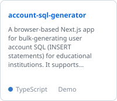</picture></a>
<a href="https://github.com/ot-nemoto/classmethod-pricing-chart"><picture><source media="(prefers-color-scheme: dark)" srcset="assets/projects/classmethod-pricing-chart-dark.svg">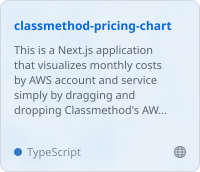</picture></a>
<a href="https://github.com/ot-nemoto/combine-pdf-files"><picture><source media="(prefers-color-scheme: dark)" srcset="assets/projects/combine-pdf-files-dark.svg">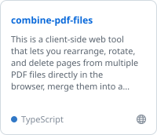</picture></a>
<a href="https://github.com/ot-nemoto/daily-hub"><picture><source media="(prefers-color-scheme: dark)" srcset="assets/projects/daily-hub-dark.svg">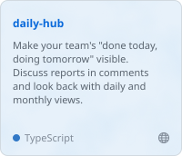</picture></a>
<a href="https://github.com/ot-nemoto/eval-hub"><picture><source media="(prefers-color-scheme: dark)" srcset="assets/projects/eval-hub-dark.svg">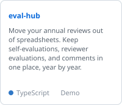</picture></a>
<a href="https://github.com/ot-nemoto/github-diff-viewer"><picture><source media="(prefers-color-scheme: dark)" srcset="assets/projects/github-diff-viewer-dark.svg">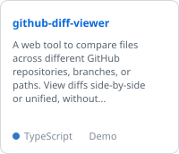</picture></a>
<a href="https://github.com/ot-nemoto/github-issue-viewer"><picture><source media="(prefers-color-scheme: dark)" srcset="assets/projects/github-issue-viewer-dark.svg">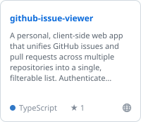</picture></a>
<a href="https://github.com/ot-nemoto/link-hub"><picture><source media="(prefers-color-scheme: dark)" srcset="assets/projects/link-hub-dark.svg">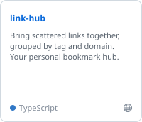</picture></a>
<a href="https://github.com/ot-nemoto/pdf-viewer"><picture><source media="(prefers-color-scheme: dark)" srcset="assets/projects/pdf-viewer-dark.svg">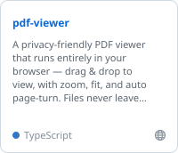</picture></a>
<a href="https://github.com/ot-nemoto/slow-query-viewer"><picture><source media="(prefers-color-scheme: dark)" srcset="assets/projects/slow-query-viewer-dark.svg">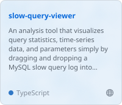</picture></a>

<!-- PROJECTS_END -->

---

<!-- LAST_UPDATED_START -->
_Last updated: 2026-09-30 15:45 JST_
<!-- LAST_UPDATED_END -->
