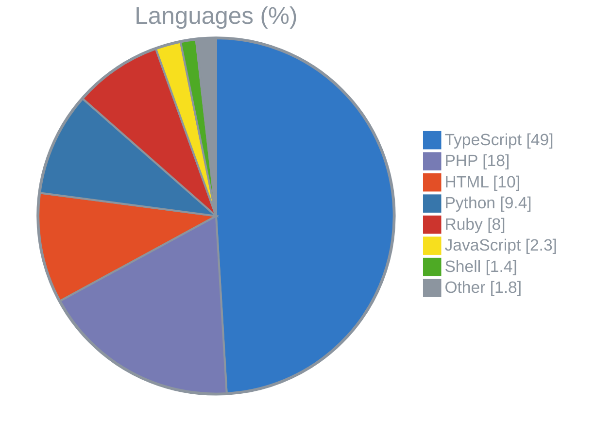
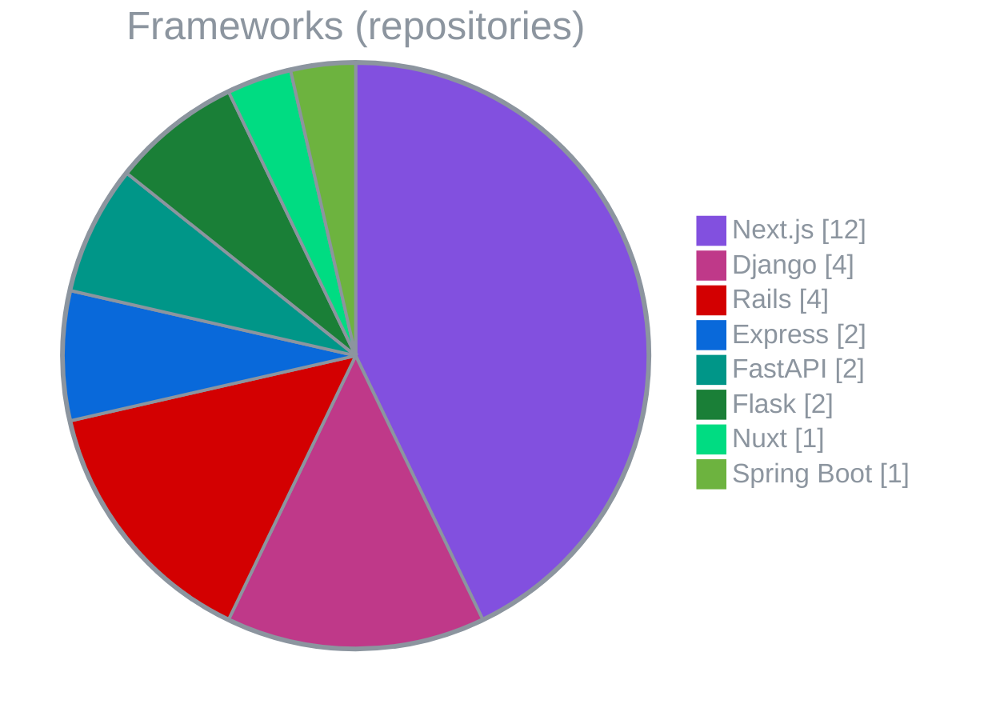

## 🛠 Tech Stack

<!-- TECH_STACK_START -->
### Languages

      

### Frameworks

       

<!-- TECH_STACK_END -->

---

## 🚀 Projects

<!-- PROJECTS_START -->
| Project | Description | |
|---|---|---|
| [pdf-viewer](https://github.com/ot-nemoto/pdf-viewer) | A privacy-friendly PDF viewer that runs entirely in your browser — drag & drop to view, with zoom, fit, and auto page-turn. Files never leave your device. | [🌐](https://ot-nemoto.github.io/pdf-viewer/) |
| [classmethod-pricing-chart](https://github.com/ot-nemoto/classmethod-pricing-chart) | This is a Next.js application that visualizes monthly costs by AWS account and service simply by dragging and dropping Classmethod's AWS billing report into the browser. It allows you to view multi-account, multi-month comparisons and annual aggregations in a single view. | [🌐](https://ot-nemoto.github.io/classmethod-pricing-chart/) |
| [account-sql-generator](https://github.com/ot-nemoto/account-sql-generator) | A browser-based Next.js app for bulk-generating user account SQL (INSERT statements) for educational institutions. It supports pasting data from Excel, automatically hashes passwords with bcrypt, and simultaneously generates SQL for multiple tables. | [🌐](https://ot-nemoto.github.io/account-sql-generator/) |
| [slow-query-viewer](https://github.com/ot-nemoto/slow-query-viewer) | An analysis tool that visualizes query statistics, time-series data, and parameters simply by dragging and dropping a MySQL slow query log into your browser. It requires no server setup and is ready to use immediately. | [🌐](https://ot-nemoto.github.io/slow-query-viewer/) |
| [combine-pdf-files](https://github.com/ot-nemoto/combine-pdf-files) | This is a client-side web tool that lets you rearrange, rotate, and delete pages from multiple PDF files directly in the browser, merge them into a single PDF, and download the result. | [🌐](https://ot-nemoto.github.io/combine-pdf-files/) |
| [github-issue-viewer](https://github.com/ot-nemoto/github-issue-viewer) | A personal, client-side web app that unifies GitHub issues and pull requests across multiple repositories into a single, filterable list. Authenticate with your own personal access token, add or remove repositories on the fly, filter by type, status, and label, and browse everything in one place. | [🌐](https://ot-nemoto.github.io/github-issue-viewer/) |
| [github-diff-viewer](https://github.com/ot-nemoto/github-diff-viewer) | A web tool to compare files across different GitHub repositories, branches, or paths. View diffs side-by-side or unified, without authentication for public repos, or with a PAT for private ones. Shareable comparison state via URL. | [🌐](https://ot-nemoto.github.io/github-diff-viewer/) |
<!-- PROJECTS_END -->

---

## ✍️ Writing

<!-- WRITING_START -->
| Project | Description |
|---|---|
| [fullstack-web-development-workshop](https://github.com/ot-nemoto/fullstack-web-development-workshop) | 📗実践フルスタックWeb開発ワークショップ |
<!-- WRITING_END -->

---

<!-- LAST_UPDATED_START -->
_Last updated: 2026-09-28 18:55 JST_
<!-- LAST_UPDATED_END -->
